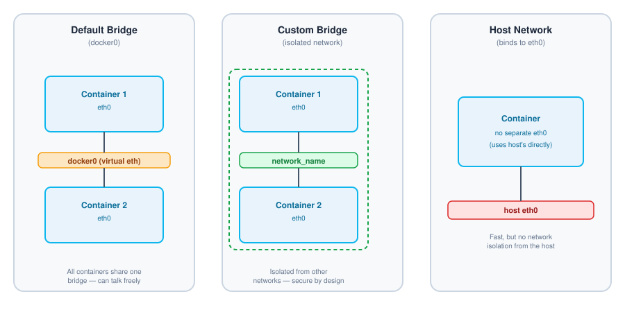

# 🌐 Docker Networks

A quick reference guide for Docker networking — how containers communicate with each other, with the host, and how to isolate them when needed.

## Table of Contents

- [What is a Docker Network?](#what-is-a-docker-network)
- [Use Cases](#use-cases)
- [Network Architecture](#network-architecture)
- [Common Network Types](#common-network-types)
  - [Bridge](#bridge)
  - [Host](#host)
  - [Overlay](#overlay)
- [Custom Bridge Network](#custom-bridge-network)
- [Network Commands](#network-commands)
  - [List Networks](#list-networks)
  - [Remove a Network](#remove-a-network)
  - [Create a Custom Bridge Network](#create-a-custom-bridge-network)
  - [Assign a Network to a Container](#assign-a-network-to-a-container)
  - [Bind a Container to the Host Network](#bind-a-container-to-the-host-network)
- [Quick Reference](#quick-reference)
- [Further Reading](#further-reading)

## What is a Docker Network?

A Docker network allows two or more containers to communicate and work together by sharing a virtual ethernet bridge that Docker creates, commonly referred to as `docker0`.

## Use Cases

1. **Dependent containers** — e.g. an app container that needs to talk to a database container.
2. **Complete isolation** — keeping a container's traffic separated from other containers or the host for security reasons.

## Network Architecture

The diagram below compares the three most common network types: the default bridge (shared by all containers), a custom bridge (isolated), and the host network (no isolation at all).



## Common Network Types

### Bridge

By default, all containers share the same virtual ethernet (`docker0`) and can freely communicate with each other.

A **custom bridge** network can be created instead to achieve isolation and security between groups of containers.

### Host

Binds the container directly to the host's `eth0` interface — the container has no network interface of its own.

> **Security note:** because there's no isolation between the container and the host network, this carries inherent security risk.

### Overlay

Used in multi-host orchestration setups such as **Kubernetes**, allowing containers running on different physical/virtual hosts to communicate as if they were on the same network.

## Custom Bridge Network

Instead of relying on Docker's default bridge, you can create your own custom bridge network and assign it to specific containers while running them. This provides **isolation and security** — useful for workloads handling sensitive information, such as finance or personal data.

## Network Commands

### List Networks

Lists all networks currently available on the host.

```bash
docker network ls
```

### Remove a Network

Deletes a network by its ID or name.

```bash
docker network rm network_id/network_name
```

### Create a Custom Bridge Network

```bash
docker network create network_name
```

### Assign a Network to a Container

```bash
docker run -d -t --name container_name --network=network_name image_name
```

### Bind a Container to the Host Network

```bash
docker run -d -t --name container_name --network=host image_name
```

>  When using `--network=host`, running `docker inspect container_name` will show an **empty IP address** for the container — that's expected, since it's using the host's `eth0` directly instead of getting its own.

## Quick Reference

| Action | Command |
|---|---|
| List networks | `docker network ls` |
| Remove a network | `docker network rm network_id/network_name` |
| Create a custom bridge network | `docker network create network_name` |
| Run a container on a custom network | `docker run -d -t --name container_name --network=network_name image_name` |
| Run a container on the host network | `docker run -d -t --name container_name --network=host image_name` |

## Further Reading

- [Docker Docs — Networking Overview](https://docs.docker.com/network/)
- [Docker Docs — Bridge Network Driver](https://docs.docker.com/network/drivers/bridge/)
- [Docker Docs — Host Network Driver](https://docs.docker.com/network/drivers/host/)
- [Docker Docs — Overlay Network Driver](https://docs.docker.com/network/drivers/overlay/)

---

**Written by Ayushm**
