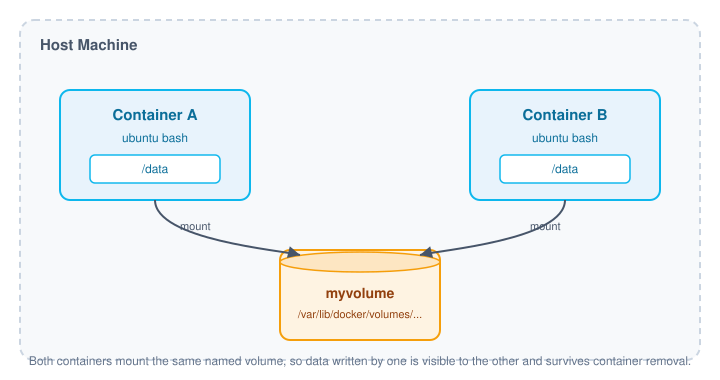

# 🐳 Docker Volumes

A quick reference guide for creating, managing, and sharing **Docker volumes** — the standard way to persist data outside of a container's writable layer.

## Table of Contents

- [What is a Docker Volume?](#what-is-a-docker-volume)
- [Volume Architecture](#volume-architecture)
- [Volume Commands](#volume-commands)
  - [Create a Volume](#create-a-volume)
  - [List Volumes](#list-volumes)
  - [Inspect a Volume](#inspect-a-volume)
  - [Remove a Volume](#remove-a-volume)
- [Mounting a Volume into a Container](#mounting-a-volume-into-a-container)
- [Sharing a Volume Across Containers](#sharing-a-volume-across-containers)
- [Quick Reference](#quick-reference)
- [Further Reading](#further-reading)

## What is a Docker Volume?

A **volume** is data storage that lives outside of a container's own filesystem. Because it isn't tied to any single container's lifecycle, the data inside a volume **persists even after the container that used it is removed**. Volumes are managed by Docker itself (as opposed to bind mounts, which point at an arbitrary path on the host).

## Volume Architecture

The diagram below shows two separate containers mounting the same named volume. Each container sees the volume at its own `/data` path, but under the hood they're reading and writing to the exact same storage on the host.



## Volume Commands

### Create a Volume

Creates a new volume managed by Docker.

```bash
docker volume create vol_name
```

### List Volumes

Lists all volumes that currently exist on the host.

```bash
docker volume ls
```

### Inspect a Volume

Shows detailed metadata for a volume, including its mount point on the host, driver, and creation date.

```bash
docker volume inspect vol_name
```

### Remove a Volume

Deletes a volume. This only works if no running container is currently using it.

```bash
docker volume rm vol_name
```

## Mounting a Volume into a Container

Use `--mount` to attach a volume to a container at a specific path:

```bash
docker run -it \
  --mount source=myvolume,target=/data \
  ubuntu bash
```

| Flag | Meaning |
|---|---|
| `source` | Name of the volume to use (created automatically if it doesn't exist) |
| `target` | Path **inside the container** where the volume will be mounted |

## Sharing a Volume Across Containers

To reuse the same data in another container, point a new container at the **same volume name**. Docker resolves `source=myvolume` to the same underlying storage, so any data written previously is still there:

```bash
docker run -it \
  --mount source=myvolume,target=/data \
  ubuntu bash
```

This is the typical pattern for sharing files between containers, or for keeping data alive across a container being stopped, removed, and recreated.

## Quick Reference

| Action | Command |
|---|---|
| Create a volume | `docker volume create vol_name` |
| List volumes | `docker volume ls` |
| Inspect a volume | `docker volume inspect vol_name` |
| Remove a volume | `docker volume rm vol_name` |
| Mount a volume into a container | `docker run -it --mount source=vol_name,target=/path ubuntu bash` |

## Further Reading

- [Docker Docs — Volumes](https://docs.docker.com/engine/storage/volumes/)
- [Docker Docs — Storage Overview](https://docs.docker.com/storage/)
